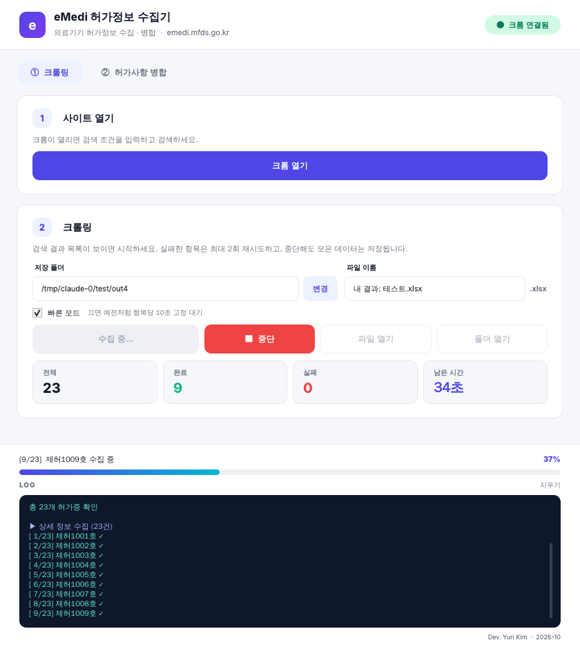

# eMedi 허가정보 수집기

A desktop app that collects medical device permit details from the MFDS medical device portal ([emedi.mfds.go.kr](https://emedi.mfds.go.kr)) into Excel, then merges in the permit list you download from 전자민원.

Built with PyQt6 and Selenium. Works on Windows and macOS.



## Features

- **① 크롤링:** open Chrome from the app, search on the site as usual, then press start. The app walks every result page, opens each item's detail popup, and saves everything to `.xlsx` and `.json`.
  - Fast mode waits only until each popup has loaded. Untick it to use a fixed 10-second wait per item.
  - Failed items are retried, and stopping or a crash still saves what was collected.
  - Live progress: total, done, failed, time left.
- **② 허가사항 병합:** adds the columns from 전자민원's 품목 허가(신고)사항 export to the crawl result, matched by permit number, as a formatted Excel file.
- You choose the save folder and file name (a dated default is filled in). If the name already exists, `_2`, `_3`, … is added.
- **파일 열기 / 폴더 열기** buttons open the result when a run finishes.
- UDI columns separate multiple values with `; `, because values can contain commas.

## Requirements

- Python 3.10+
- Google Chrome. The matching ChromeDriver is downloaded automatically on first run, so the first run needs internet.

## Run from source

```bash
pip install -r requirements.txt
python app.py
```

## Build a double-clickable app

Build on the OS you want to run it on.

| OS | How | Result |
|---|---|---|
| Windows | double-click `build_windows.bat` | `dist\emedi_crawler\emedi_crawler.exe`. Keep the whole folder together and make a desktop shortcut to the exe. |
| macOS | `bash build_mac.sh` | `dist/emedi_crawler.app`. Drag it to Applications. The first time, right-click it and choose Open. |

The built app doesn't need Python, only Chrome. Rebuild after changing `app.py`.

If something goes wrong in the built app, details are written to `~/emedi_crawler.log`.

## Tuning

Wait times are constants at the top of `app.py`:

| Constant | Default | Meaning |
|---|---|---|
| `MODAL_TIMEOUT` | 20 s | Max wait for a detail popup |
| `MODAL_SETTLE` | 1.0 s | Popup content must stay unchanged this long to count as loaded |
| `POLITE_DELAY` | 0.3 s | Pause between items, to be gentle on the site |
| `MODAL_WAIT` | 10 s | Fixed wait used when fast mode is off |

## Notes

The crawler relies on the site's current page structure (the `getList` / `itemDetail` functions and the popup's table captions). If the site changes, `PARSE_JS` and the selectors near the top of `app.py` are where to look.

---

Dev. Yuri Kim · 2026-10
